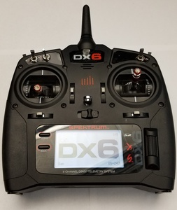
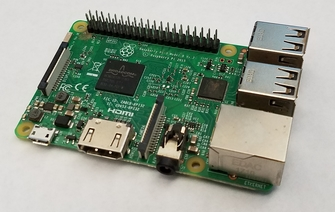
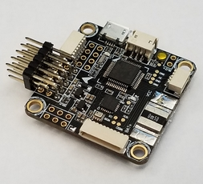
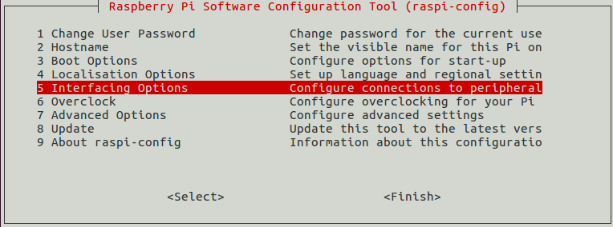
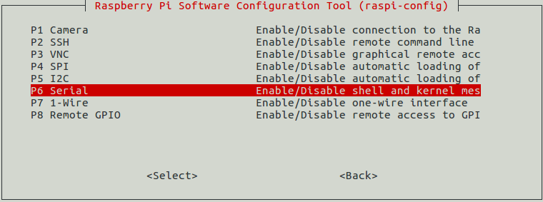
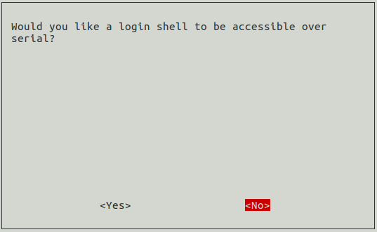
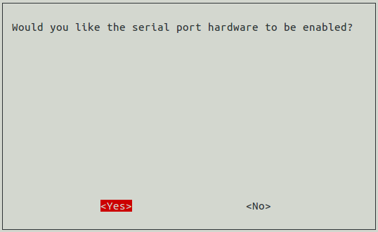
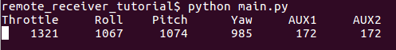

# remote_receiver_tutorial

This tutorial demonstrates interfacing a radio transmitter and receiver with a
Raspberry Pi over the Spektrum remote receiver (aka Spektrum satellite)
protocol.

## You will need
* A radio transmitter: I used the Spektrum
[DX6](http://spektrumrc.com/Products/Default.aspx?ProdId=SPMR6750)
transmitter but others should work too

* A radio receiver: I used a Spektrum
[AR7700](http://spektrumrc.com/Products/Default.aspx?ProdID=SPMAR7700)
and a Spektrum
[DSMX remote receiver](http://spektrumrc.com/Products/Default.aspx?ProdID=SPMAR7700)
, but you only need one that is compatible with
your transmitter and has a Spektrum remote receiver protocol output. I assume
that your transmitter and receiver have already been bound. Instructions
for binding transmitters and receivers should be found with the manufacturer.

Example receivers capable of communicating over the remote receiver serial
protocol: AR7700 (left) and DSMX remote receiver(right)

* A Raspberry Pi: I used a Raspberry Pi 3 with Raspbian Stretch installed.
It may actually be easier to interface with older Raspberry Pis and OS 
distributions because of how Raspberry Pi's now handle their UART ports.

* (optional) A flight control board: If you want to send rc signals to a flight
control board capable of handling the remote receiver protocol. I used an
Omnibus F3 Pro. Configuring flight control boards is beyond the scope of this
tutorial.

## Hardware wiring
* Connect the receiver's ground to the Raspberry Pi ground.
* Connect the receiver's power to the appropriate Raspberry Pi power
pin. For example, the AR7700, connect the Raspberry Pi's 5V output to the
AR7700 5V rail, and for the Spektrum Remote Receiver unit, connect the
Raspberry Pi's 3.3V output to the receiver's 3.3V line)
* Connect the receiver's signal line to the Raspberry Pi RXD UART GPIO pin
(GPIO 15 / pin 10 on the Raspberry Pi 3). Beware that the Pi's GPIO pins
operate at 3.3V, so if your receiver outputs a 5V signal, you'll want a
level-shifter to avoid ruining the Pi's GPIOs.

Diagram of a remote receiver connected to the Raspberry Pi. Note whether your
receiver uses 3.3V or 5V input power.

* (optional) Connect the Raspberry Pi's TXD UART GPIO pin (GPIO 14 / pin 8 on
the Raspberry Pi 3) to the flight control board if you would like to forward
the data from the receiver to the Raspberry Pi to the flight control board.

## Raspberry Pi configuration

We need to setup the software environment and the serial port before running
the code.

### Software requirements
* Python 2.7
* Python pip - Install with `sudo apt install python-pip`
* pySerial - Install with `sudo pip install pyserial`
* A clone of this tutorial repo

### Serial port setup
The serial communication will use the UART pins on the Raspberry Pi 3 and have
a rather complicated setup as documented
[here](https://www.raspberrypi.org/documentation/configuration/uart.md)
and nicely blogged about
[here](https://spellfoundry.com/2016/05/29/configuring-gpio-serial-port-raspbian-jessie-including-pi-3/).
There are two UART ports: a hardware UART port and a "mini" UART port which are
accessed at `/dev/ttyAMA0` and `/dev/ttyS0`, respectively.

There are a some defaults that confound our use of GPIOs 15 and 14 for serial
communication with the receiver:
* By default, GPIOs 15 and 14 are connected to the mini UART at `/dev/ttyS0`
because the bluetooth module is using the hardware UART at `/dev/ttyAMA0`.
Unfortunately, the mini UART is flakier than the hardware UART, so we'd like to
connect GPIOs 15 and 14 to hardware UART at `/dev/ttyAMA0`. To do so, we need
to either swap the port used by bluetooth or disable bluetooth.
  * To swap the UART port used by the bluetooth module, add 
  `dtoverlay=pi3-miniuart-bt` to the Pi's `/boot/config.txt`
  * To disable the bluetooth module entirely, add
  `dtoverlay=pi3-disable-bt` to the Pi's `/boot/config.txt` (recommended)
* By default, the Raspberry Pi uses the non-bluetooth serial port to provide
a serial console. We need to disable the console to allow the port to be used
for our serial communication with the receiver. To do so, run
`sudo raspi-config` and then

Select `Interfacing Options`

Select `P6 Serial`

Disable the login shell over serial

Enable the serial port hardware

## Run the code
Power on the transmitter and run `python main.py` from within the cloned repo
on the Raspberry Pi. The code should output the values received from the
transmitter.

Try toggling the transmitter power and seeing that the signals received stop
and start with the transmitter power. 

(optional) If you [connected](#Hardware wiring) the UART TXD (GPIO 14 / pin 14)
to a flight control board set up to receive data according to the remote
receiver protocol, you'll be able to also view the RC signals in, for example,
Betaflight.

## Background
I wanted to put a Raspberry Pi on a quadcopter and use it for some of the
quadcopter's control, so I needed to find a way to connect the Pi to the radio
receiver used to receive control signals from the transmitter on the ground.
Honestly, it's a mess out there with radio receivers. There are a lot of
receivers out there with all sorts of available output options. Figuring out
which receiver 

I started with a receiver (the Spektrum 
[AR610](http://spektrumrc.com/Products/Default.aspx?ProdID=SPMAR610))
onhand that output pulse-width modulated (PWM) signals.
I found that it is possible to read PWM signals using the Raspberry Pi's GPIO
pins and interrupts even though the Pi does not run a real-time operating
system because the PWM signals output by the receiver were slow
enough that the timing of the OS didn't significantly affect the signal
measurements. Still, PWM signals are product of the days of DC motors and
servos and not great for interfacing with a Raspberry Pi:
1. Each channel requires its own wire and pin, so your build becomes
a rat's nest quickly. More wires and pins = more opportunities for circuit
shorts and opens.
2. You'll always wonder whether the OS is going to hiccup and skew a
pulse-width measurement during flight and cause your build to crash...

The first issue was the biggest issue in my mind since I had to maintain the
quadcopter build (i.e. make sure all of the wires went to the right places and
stayed there on a platform subject to crashes and lots of vibrations)

Spektrum documents the remote receiver protocol [here](https://www.spektrumrc.com/ProdInfo/Files/Remote%20Receiver%20Interfacing%20Rev%20A.pdf)

## Questions and Comments
Raise an issue or drop me a message.
